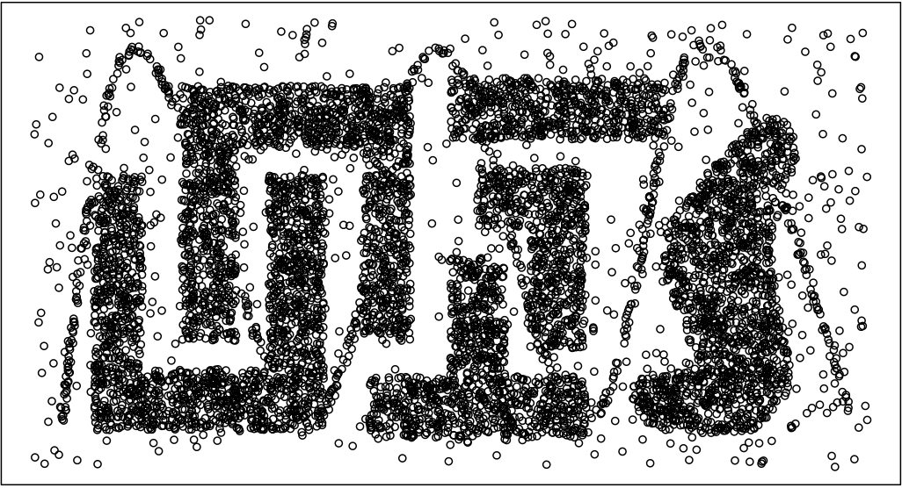
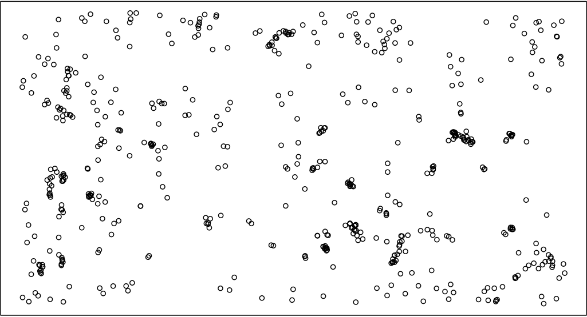
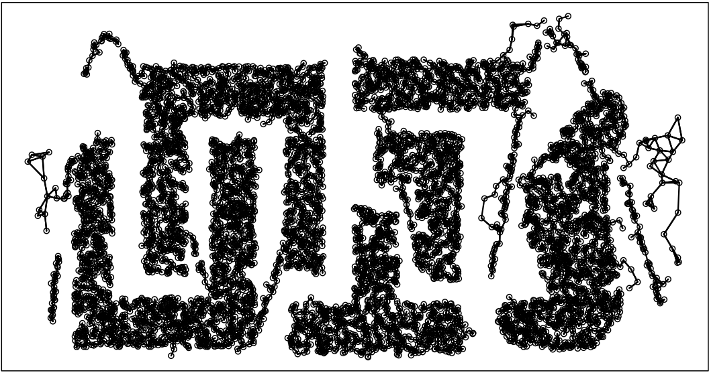

# CPFcluster

CPFcluster is a Python library for implementing the Component-wise Peak Finding (CPF) method introduced in 'Scalable Clustering of Mixed Data using Nearest Neighbor Graphs and Density Peaks'. 


## Set Up

Use the package manager [pip](https://pip.pypa.io/en/stable/) to install CPFcluster.

```bash
pip install CPFcluster
```
To download the data sets, either use the links given in data/Datasets.md or, to download all data sets: 

```bash
sh download_data.sh
```
## Run

To run CPFcluster on the downloaded data:

```bash
sh bin/run_downloaded.sh
```
The above script will save cluster labels to a csv file in a new 'results' folder. Also included is a brief script to execute code on a synthetic numeric data set which demonstrates the 'train' function of the CPFclustering class. To execute:

```bash 
python bin.run_synthetic.py
```
All source code for the method is available from [pip](https://pip.pypa.io/en/stable/) or in the /src folder. 
## License
[MIT](https://choosealicense.com/licenses/mit/)

## Contributing
Pull requests are welcome. For major changes, please open an issue first to discuss what you would like to change.

Please make sure to update tests as appropriate.

## Questions or Comments
Please contact Joshua Tobin ([tobinjo@tcd.ie](mailto:tobinjo@tcd.ie)). 

  
