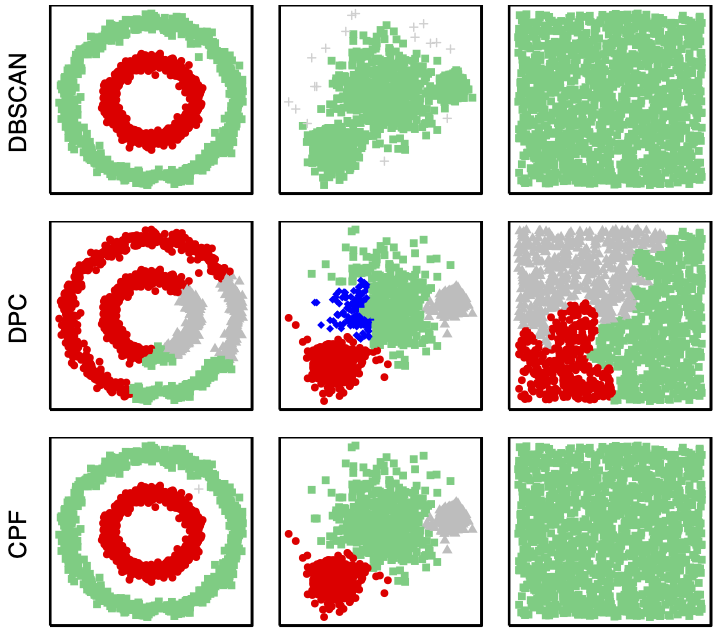

CPFcluster
========

An implementation of the Component-wise Peak-Finding (CPF) clustering method, presented in 'Scalable and Adaptable Density-Based Clustering using Level Set and Mode-Seeking Methods'.

<p align="center" width="100%">
    
</p>

Dependencies
------------

*CPFcluster* supports Python 3, with numpy, scipy, itertools, multiprocessing and scikit-learn. These should be linked with a BLAS implementation
(e.g., OpenBLAS, ATLAS, Intel MKL). 

Installation
------------

[CPFcluster](https://pypi.python.org/pypi/CPFcluster) is available on PyPI, the Python Package Index.

```sh
$ pip install CPFcluster
```

How To Use
----------

To use CPFcluster, first import the *CPFcluster* module.
```python
    from CPFcluster import CPFcluster
```    
### Clustering a Dataset

A CPFcluster object is constructed using the *fit* method, which returns a clustering of a dataset.
```python
    CPF = CPFcluster(k, rho, alpha, n_jobs, remove_duplicates, cutoff)
    CPF.fit(X)
```    
CPFcluster takes 6 arguments:

* **k** Number of nearest-neighbors used to create connected components from the dataset and compute the density.
* **rho** (Defaults to 0.4) Parameter used in threshold for center selection.
* **alpha** (Defaults to 1) Optional parameter used in threshold of edge weights for center selection, not discussed in paper.
* **n_jobs** (Defaults to 1) Number of cores for program to execute on. 
* **remove_duplicates** (Defaults to False) Option to remove duplicate rows from data in advance of clustering. 
* **cutoff** (Defaults to 1) Threshold for removing instances as outliers. Instances with fewer edges than the cutoff value are removed. 

The CPFcluster object is then fit to a dataset:
* **X** An *n-by-d* numpy.ndarray with training data. The rows correspond to *n* observations, and the columns
  correspond to *d* dimensions.

The result object further contains:
* **CCmat** An *n-by-n* sparse matrix representation of the *k*-NN graph.  
* **components** A vector containing the index of the component to which each instance belongs. If the instance is an outlying point, the value will be NaN. 
* **ps** A list of tuples containing the number of instances and the proportion of instances for which a point of higher density was not present in the nearest neighbours for each component.
* **peaks** A vector containing the index of the peaks selected as cluster centers. 
* **memberships** The final cluster labelings. 


CPFmatch for Multi-Image Matching
----------

CPFmatch is the modified version of CPF applicable for the multi-image matching problem. To use CPFmatch, first import the *CPFmatch* module.
```python
    from CPFcluster import CPFmatch
```    
### Clustering a Dataset

A CPFmatch object is constructed using the *fit* method, which returns a clustering of a dataset.
```python
    match = CPFmatch(k, rho, alpha, n_jobs, remove_duplicates, cutoff)
    match.fit(X, img_label)
```    
CPFmatch takes the same 6 arguments as CPFcluster:

* **k** Number of nearest-neighbors used to create connected components from the dataset and compute the density.
* **rho** (Defaults to 0.4) Parameter used in threshold for center selection.
* **alpha** (Defaults to 1) Optional parameter used in threshold of edge weights for center selection, not discussed in paper.
* **n_jobs** (Defaults to 1) Number of cores for program to execute on. 
* **remove_duplicates** (Defaults to False) Option to remove duplicate rows from data in advance of clustering. 
* **cutoff** (Defaults to 1) Threshold for removing instances as outliers. Instances with fewer edges than the cutoff value are removed. 

The CPFmatch object is then fit to a dataset with the label of the images included also:
* **X** An *n-by-d* numpy.ndarray with training data. The rows correspond to *n* observations, and the columns
  correspond to *d* dimensions.
* **img_label** An *n-by-1* numpy.ndarray with the image label for each feature. The rows correspond to *n* keypoints, and no two keypoints from the same image will be clustered together.

The result object further contains as before:
* **CCmat** An *n-by-n* sparse matrix representation of the *k*-NN graph.  
* **components** A vector containing the index of the component to which each instance belongs. If the instance is an outlying point, the value will be NaN. 
* **ps** A list of tuples containing the number of instances and the proportion of instances for which a point of higher density was not present in the nearest neighbours for each component.
* **peaks** A vector containing the index of the peaks selected as cluster centers. 
* **memberships** The final cluster labelings. 


Experimentation
-------
To replicate the experiments in the original paper:
```sh
python3 download_data.py
python3 run_downloaded.py
```

CPFcluster
-------

*CPFcluster* has an [MIT License](https://en.wikipedia.org/wiki/MIT_License).

See [LICENSE](LICENSE).


